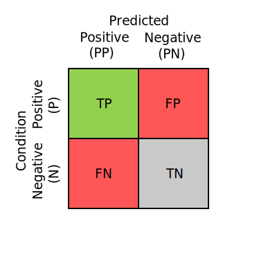
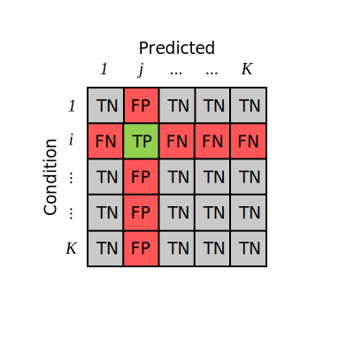

---

::: bayes_conf_mat.metrics._metrics.DiagMass
::: bayes_conf_mat.metrics._metrics.Prevalence
::: bayes_conf_mat.metrics._metrics.ModelBias
::: bayes_conf_mat.metrics._metrics.TruePositiveRate
::: bayes_conf_mat.metrics._metrics.FalseNegativeRate
::: bayes_conf_mat.metrics._metrics.PositivePredictiveValue
::: bayes_conf_mat.metrics._metrics.FalseDiscoveryRate
::: bayes_conf_mat.metrics._metrics.FalsePositiveRate
::: bayes_conf_mat.metrics._metrics.TrueNegativeRate
::: bayes_conf_mat.metrics._metrics.FalseOmissionRate
::: bayes_conf_mat.metrics._metrics.NegativePredictiveValue
::: bayes_conf_mat.metrics._metrics.Accuracy
::: bayes_conf_mat.metrics._metrics.BalancedAccuracy
::: bayes_conf_mat.metrics._metrics.MatthewsCorrelationCoefficient
::: bayes_conf_mat.metrics._metrics.CohensKappa
::: bayes_conf_mat.metrics._metrics.F1
::: bayes_conf_mat.metrics._metrics.FBeta
::: bayes_conf_mat.metrics._metrics.Informedness
::: bayes_conf_mat.metrics._metrics.Markedness
::: bayes_conf_mat.metrics._metrics.P4
::: bayes_conf_mat.metrics._metrics.JaccardIndex
::: bayes_conf_mat.metrics._metrics.PositiveLikelihoodRatio
::: bayes_conf_mat.metrics._metrics.LogPositiveLikelihoodRatio
::: bayes_conf_mat.metrics._metrics.NegativeLikelihoodRatio
::: bayes_conf_mat.metrics._metrics.LogNegativeLikelihoodRatio
::: bayes_conf_mat.metrics._metrics.DiagnosticOddsRatio
::: bayes_conf_mat.metrics._metrics.LogDiagnosticOddsRatio
